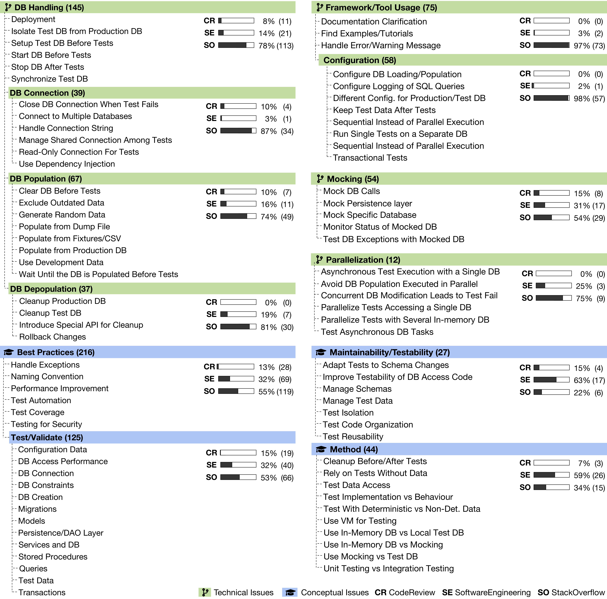

# DB Manipulation Code Testing

Replication package for the paper entitled "Challenges and Perils of Testing Database Manipulation Code."

## How do developers test database access code?

- [Tools with usage description to run the analysis](motivation/scripts)
- [Full list of the projects](motivation/clonedProjects.csv)
- [Imports used to filter projects using database access technologies](motivation/import_packages.csv)
- [The final 72 projects and their coverage measures](motivation/ResultSet-Final.csv)
- [SQLite DB of the database access and coverage analyses](motivation/dataset.db)

## What are the main challenges/problems when testing database access code?

The final classification for the research question.

- [Summary of labels](problems/category_summary.csv)
- [StackExchange questions and their final labels](problems/question_categories.csv)

