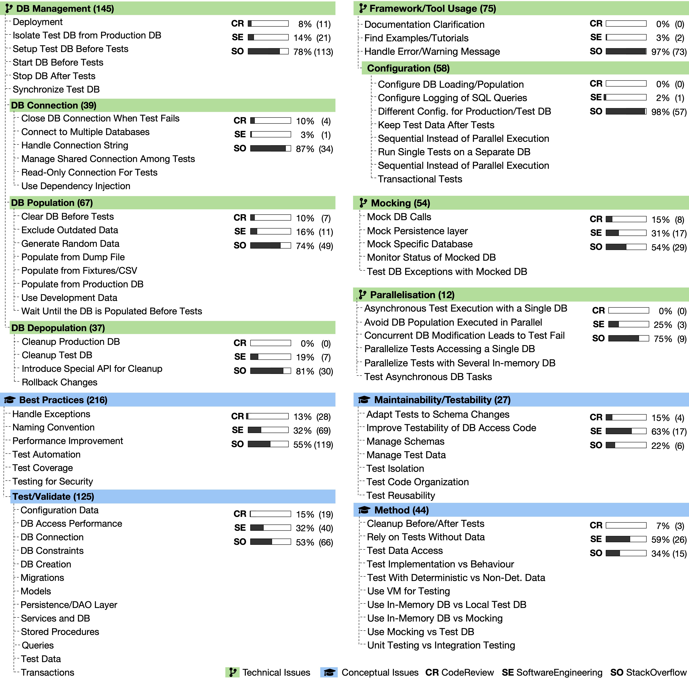
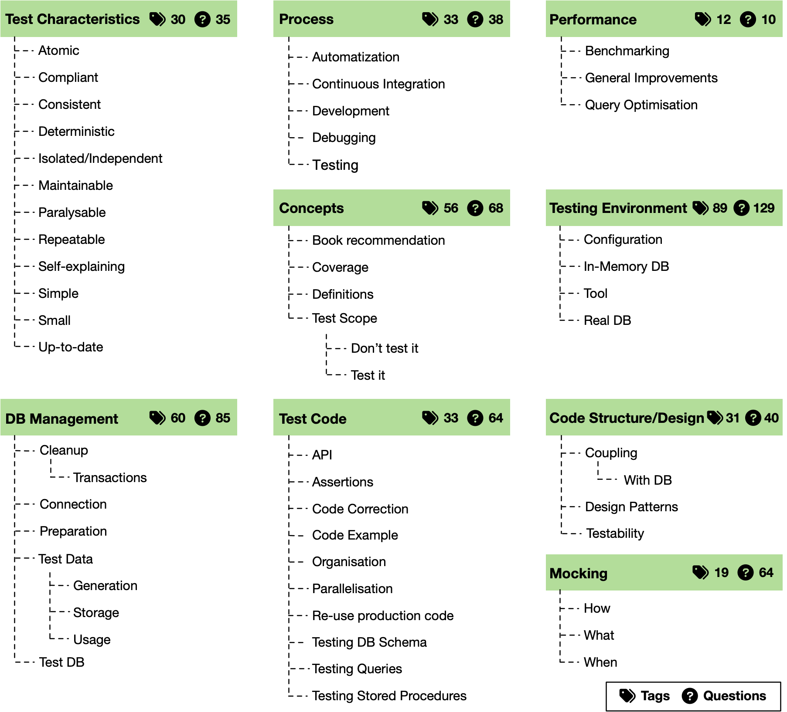

# DB Manipulation Code Testing

Replication package for the paper entitled "Best Practices of Testing Database Manipulation Code," submitted to the [Elsevier Information Systems](https://www.journals.elsevier.com/information-systems) journal.

The paper extends the CAiSE 2021 paper "Challenges and Perils of Testing Database Manipulation Code."

## Motivational Study: How do developers test database access code?

- [Tools with usage description to run the analysis](motivation/scripts)
- [Full list of the projects](motivation/clonedProjects.csv)
- [Imports used to filter projects using database access technologies](motivation/import_packages.csv)
- [The final 72 projects and their coverage measures](motivation/ResultSet-Final.csv)
- [SQLite DB of the database access and coverage analyses](motivation/dataset.db)

## Study I: What are the main challenges/problems when testing database access code?

The final classification for the research question.

- [Summary of labels](problems/category_summary.csv)
- [Stack Exchange questions and their final labels](problems/question_categories.csv)
- [Screenshot of the labeling platform showing a tagged question](problems/Platform_QuestionTagging.png)
- [Screenshot of the labeling platform showing resolved conflicts for a question](problems/Platform_ConflictResolving.png)

## Study II: What are the best practices when testing database access code?

- [Summary of labels](solutions/tags_summary.csv)
- [Stack Exchange questions, their answers, final labels, and highlights](solutions/questions_answers_tags.csv)
- [Screenshot of the labeling platform showing the tagging of answers](solutions/Platform_AnswerTagging.png)

## Additional Material

- [Stack Exchange questions referenced in the paper](StackExchange_references.csv)
